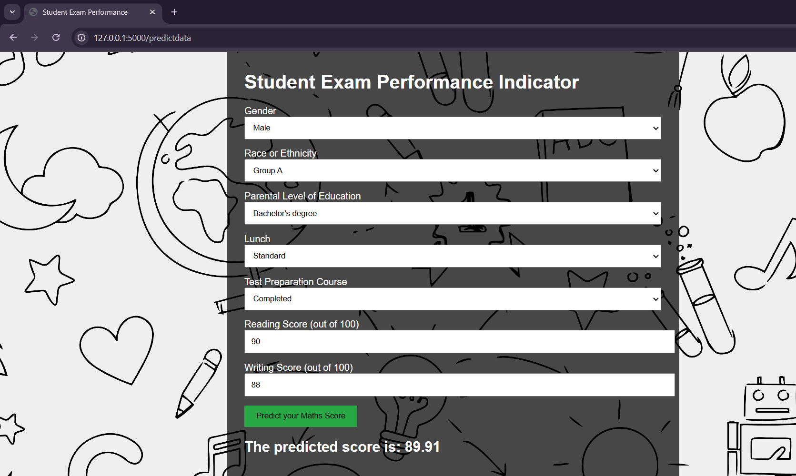

# 🎓 Student Performance Predictor - End-to-End Machine Learning Project

A complete ML pipeline including data ingestion, preprocessing, model training, evaluation, and deployment.

---

## 📸 Demo
Here’s a screenshot of the output:

---

🚀 Project Overview

The Student Performance Predictor is an end-to-end machine learning project that aims to predict a student's final exam score based on various input features such as study time, past performance, parental background, and more.

This project demonstrates the complete lifecycle of a machine learning solution — from data ingestion and exploratory analysis to model training, evaluation, and deployment using a Flask web application.

The primary goal is to showcase how machine learning can be applied to real-world problems in education and help identify students who may need academic support early on.

🔍 Key Objectives:
 - Understand and clean real-world student performance data

 - Perform exploratory data analysis (EDA) and feature engineering

 - Build and evaluate multiple regression models

 - Develop an ML pipeline for consistent preprocessing and training

 - Deploy the final model into a user-friendly Flask web app

---

🧠 Problem Statement
Predicting student performance can help educators identify at-risk students early and tailor interventions to improve outcomes. This project aims to demonstrate how machine learning can support education analytics.

---

📂 Directory Structure
student-performance-predictor/
├── .ebextensions/
├── artifacts/
├── images/
├── notebook/
├── src/
├── static/
├── templates/
├── .gitignore
├── README.md
├── app.py
├── application.py
├── requirements.txt
├── setup.py

---

  
